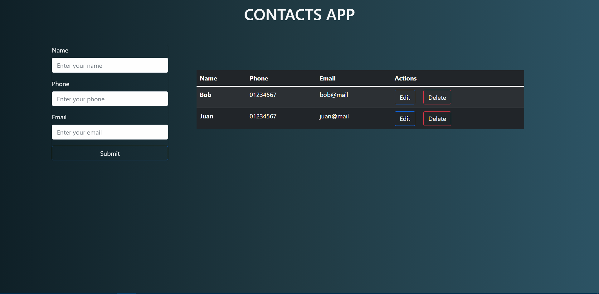
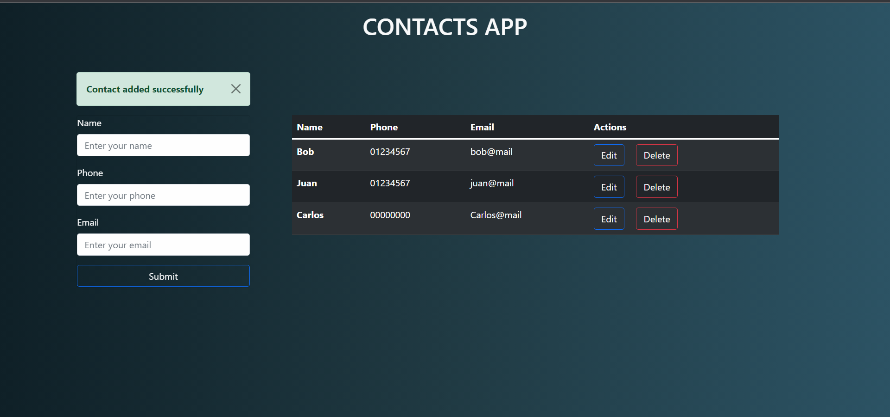
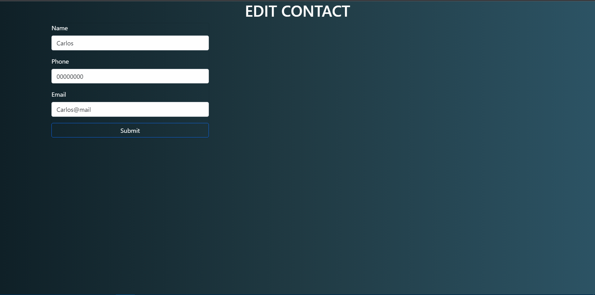
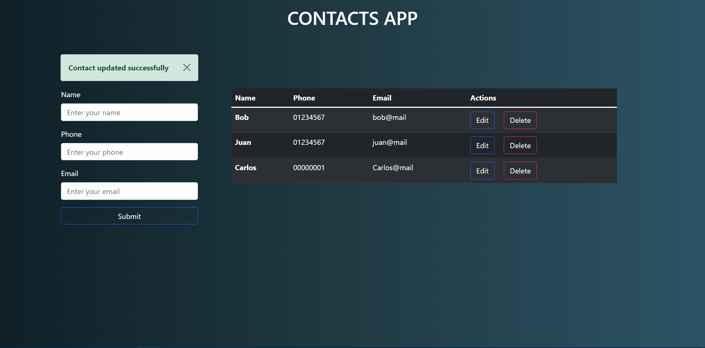
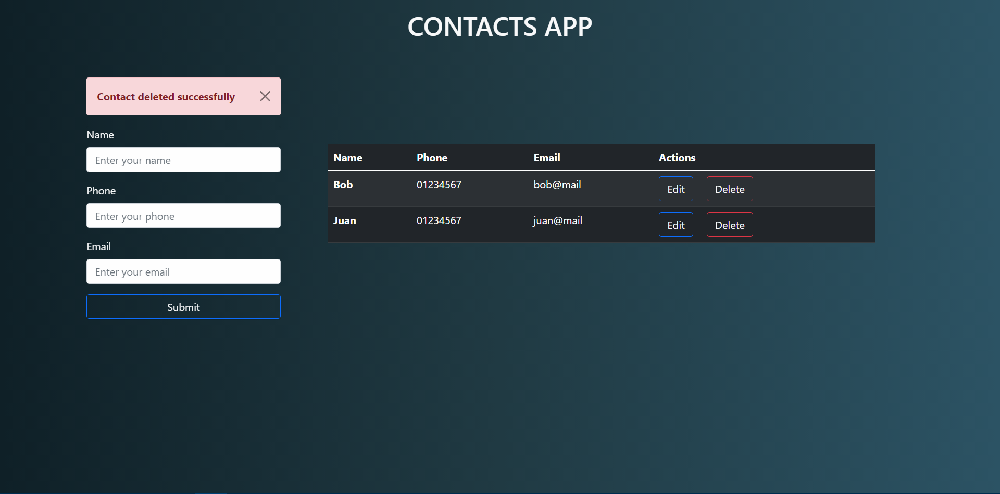

# FlaskContactsApp

## La aplicación consiste en un CRUD con flask y mysql.

___
### Al iniciar se mostraran listados los contactos y un formulario para agregar contactos.

### Al llenar los campos y enviarlos se guardaran en la base de datos.

## Se mostrará un formulario para editar los contactos.

## Eliminar contactos.

